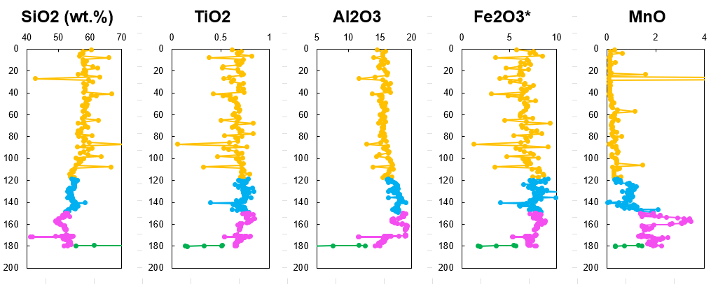
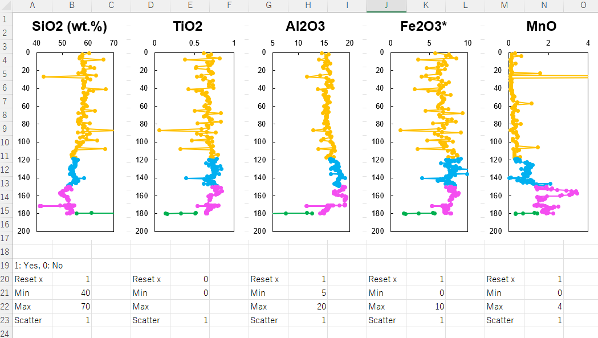

# CoreAnalyzer
Excel VBA to generate downhole profiles and scatter diagrams

   
   

# Download and activate macro
- Select <a href="/CoreAnalyzer_v2_2.xlsm">CoreAnalyzer_v2_2.xlsm</a> and download.

   

- Trust the excel file.

https://learn.microsoft.com/DeployOffice/security/internet-macros-blocked#guidance-on-allowing-vba-macros-to-run-in-files-you-trust

- Open file and activate macro

If you have security concerns, please see <a href="/writeVBA/">writeVBA</a>

# usage of excel file
1. Create a new worksheet (any sheet name) and paste your data. Element name should be placed horizontally. 

   

2. In the new sheet, press ctrl + Shift + i to create input sheet.

3. Enter information to be referenced in generating graphs in yellow cells.

   

4. In the input sheet, press ctrl + r to create graph examples. If you want to change reference, delete both graph and press ctrl + r again.

5. Modify colors, marker types, lines of graphs as you like. The style determined here will be applied to all graphs.

   

6. Press ctrl + t to create downhole variations of all elements.

   

7. To change x-ranges, input '1' to row 20 ("reset x"), and designate minimum and maximum values. This range is also referenced when generating scatter diagrams.

8. Press ctrl + Shift + t to change xranges.

   

9. Input '1' for to row 23 for elements you want to generate scatter diagrams. It takes some time depending on PC spec, so please select 5-10 elements at the first time.

10. In the worksheet of downhole profiels, press ctrl + n to create scatter diagrams.

   

11. (optional) If you want to change information in the input sheet, modify and press ctrl + Shift + n

