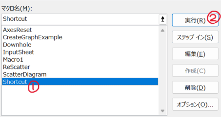

# Write VBA yourself

- Select <a href="/CoreAnalyzer_v2_2_NoVBA.xlsm">CoreAnalyzer_v2_2_NoVBA.xlsm</a> and download.

   

- Open file and press alt + F11 to open VBA editor

   

- Insert module

   

- Copy <a href="/VBAcode.txt">VBAcode.txt</a> and paste to the module

   

- Close VBA editor and press alt + F8 in any datasheet

- Select "Shortcut" and run

   

- Follow <a href="../README.md#usage-of-excel-file">usage of excel file</a>.